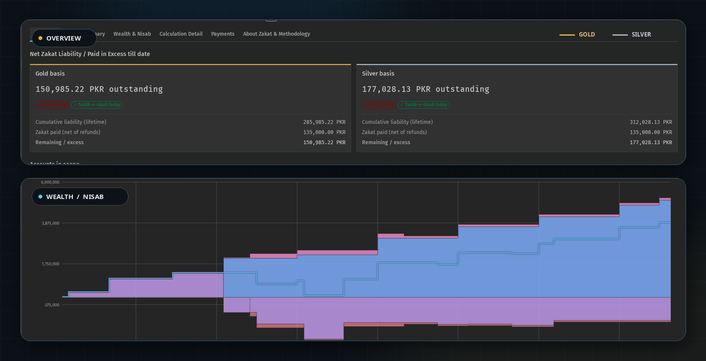
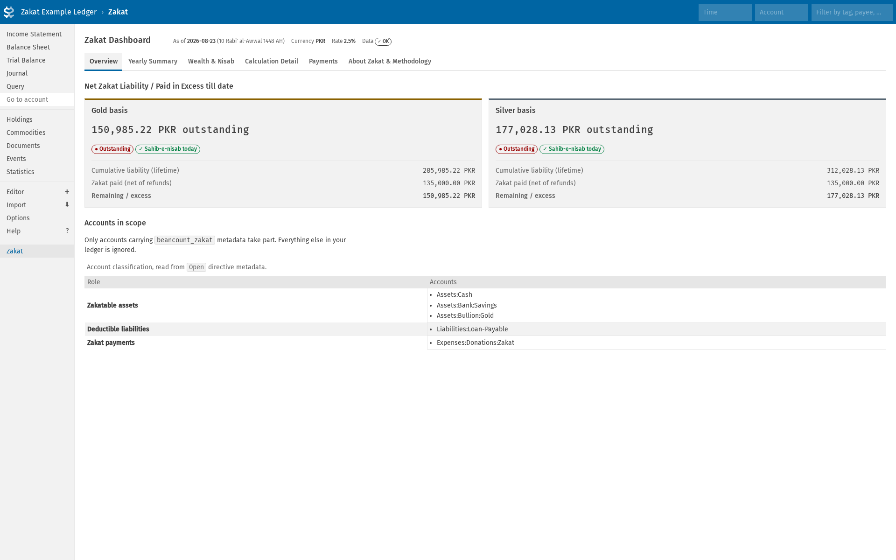
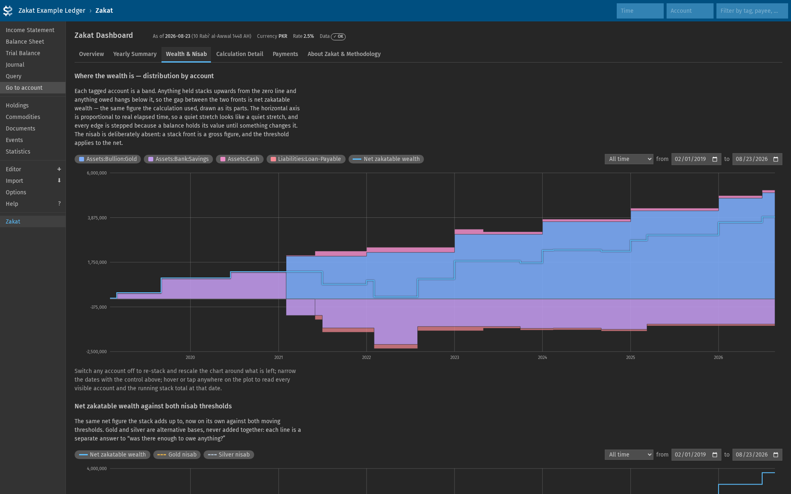
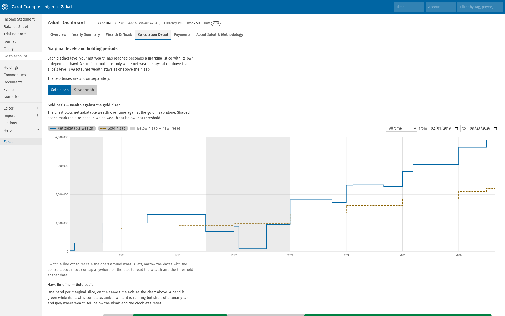
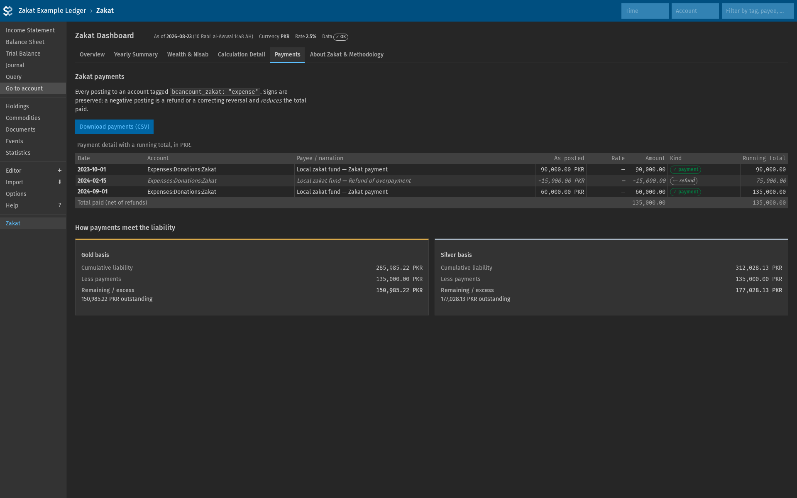

# beancount-zakat

[](https://github.com/WildeBeast2521/beancount-zakat/actions/workflows/ci.yml)
[](https://pypi.org/project/beancount-zakat/)
[](https://pypi.org/project/beancount-zakat/)
[](https://pypi.org/project/beancount-zakat/)
[](https://pypi.org/project/beancount-zakat/#files)
[](https://pypi.org/project/beancount-zakat/)
[](LICENSE)

Zakat calculation for [Beancount](https://beancount.github.io/) ledgers, with a [Fava](https://beancount.github.io/fava/) dashboard and a standalone CLI.

<p align="center">
  
</p>

Written with AI assistance. See [How this was built](#how-this-was-built).

---

## Contents

- [What it does](#what-it-does)
- [Scope](#scope)
- [Installation](#installation)
- [Setting up your ledger](#setting-up-your-ledger)
- [The Fava dashboard](#the-fava-dashboard)
- [The CLI](#the-cli)
- [CSV export](#csv-export)
- [Configuration](#configuration)
- [How the calculation works](#how-the-calculation-works)
- [Assumptions and limitations](#assumptions-and-limitations)
- [Troubleshooting](#troubleshooting)
- [How this was built](#how-this-was-built)
- [Contributing](#contributing)
- [License](#license)
- [Disclaimer](#disclaimer)

---

## What it does

- Reads **every entry** loaded by your root ledger, `include`d files and all.
- Selects accounts purely from `beancount_zakat` metadata on `Open` directives.
- Reconstructs net zakatable wealth over time, re-valuing holdings in other commodities whenever their prices move.
- Runs a **layered / marginal hawl** model: every distinct wealth level becomes a slice with its own independent holding period.
- **Dynamic nisab:** the prices (as available from the beancount ledger) of gold and silver affect the nisab continuously.
- Computes gold and silver independently.
- Reports zakat owed (positive), or paid in excess (negative).
- Defaults the cutoff to today.

## Scope

### In-Scope

`beancount-zakat` reads real-time balances of all accounts with the `beancount_zakat` metadata, compares with the nisab, and applies the rate of 2.5%, and as the rate of 2.5% applies on general assets, therefore, for now, only the following zakatable assets supported:

- **Cash, bank balances and other short-term asset**
- **Holdings in other commodities:** Gold, silver, a foreign currency, or any other commodity, valued from the `price` directives already in your ledger.
- **Stock bought for resale (short-term):** Shares or inventory held as trade goods, bought with the intention of selling on, are counted at market value like any other commodity holding.
- **General short-term debts:** deducted from the total.

### Out-Scope

- **Zakat al-fitr:** the per-person charge at the end of Ramadan before Eid-ul-Fitr.
- **Agricultural produce, livestock and *rikaz*:** These carry their own rates and thresholds and are not modelled.
- **Stock bought for holding (long-term):** Zakat is due on the proportionate ownership of the Zakatable assets of the companies invested in, or (as a proxy) 2.5% of 25% of the market value of shares. This has not been implemented as of yet.

### What is yours to decide

- **Which assets are zakatable:** All and any asset, liability and expense account tagged with the `beancount_zakat` metadata.
- **Which debts are deductible:** Same mechanism, same reasoning.
- **Which basis to follow:** Gold and silver are alternatives. Both are shown so you can compare them.
- **The nisab weights:** If the authority you follow publishes different gram equivalents. They are configurable.
- **Whether this tool's method matches your position:** It accrues liability in proportion to time held once the hawl is met — see [How the calculation works](#how-the-calculation-works).

## Installation

Requires Python 3.10 or newer, and works with Beancount 3.x. The dashboard needs Fava 1.30 or newer.

```bash
# Calculation engine and CLI only (does not install Fava):
pip install beancount-zakat

# With the Fava dashboard:
pip install 'beancount-zakat[fava]'
```

## Setting up your ledger

### 1. Tag your accounts

The `beancount_zakat` metadata key on an `Open` directive puts an account in scope. Three roles are recognised:

| Value | Meaning |
|---|---|
| `"asset"` | Counts positively towards zakatable wealth |
| `"liability"` | Counts as a deductible from zakatable wealth |
| `"expense"` | Postings here are zakat payments, discharge of obligation |

```beancount
2020-01-01 open Assets:Bank:Savings       PKR
  beancount_zakat: "asset"

2020-01-01 open Assets:Cash               PKR
  beancount_zakat: "asset"

2020-01-01 open Liabilities:Loan-Payable  PKR
  beancount_zakat: "liability"

2020-01-01 open Expenses:Donations:Zakat  PKR
  beancount_zakat: "expense"

;; Untagged, so ignored entirely — this is how you exclude a personal-use asset.
2020-01-01 open Assets:Vehicle            PKR
```

Classification is **exact**: tagging `Assets:Bank` does not pull in `Assets:Bank:Savings`. Tag each account you want included. Metadata works in `include`d files just as well as in the root ledger.

### 2. Record metal prices

Prices come from ordinary `price` directives in your own ledger. `GLDTOLA` and `SLVTOLA` are understood out of the box as prices **per tola**:

```beancount
2026-01-01 price GLDTOLA  280000.00 PKR
2026-01-01 price SLVTOLA    3300.00 PKR
```

You only need a directive when the price actually moves, a day with no price of its own reuses the last known price. A price older than 90 days is still used but is flagged as stale.

To quote per gram, or to use different symbols, declare them explicitly. The unit is required:

```beancount
2020-01-01 custom "fava-extension" "beancount_zakat.fava_extension" "{
  'metal_commodities': {'XAUGRAM': ['gold', 'gram'],
                        'XAGGRAM': ['silver', 'gram']},
}"
```

### 3. Register the dashboard

```beancount
2020-01-01 custom "fava-extension" "beancount_zakat.fava_extension" "{}"
```

A complete and synthetic example lives in [`examples/ledger/main.beancount`](examples/ledger/main.beancount), covering assets, a liability, payments and a refund, gold and silver prices, a holding in another commodity, `include`d files, a nisab break and recovery, and a quiet tail with no recent transactions.

## The Fava dashboard

```bash
fava examples/ledger/main.beancount
```

Then open the **Zakat** report. Six tabs:

1. **Overview** — side-by-side gold and silver cards showing lifetime liability, payments and the balance; data-quality status; accounts in scope.
2. **Yearly Summary** — Summary per Hijri year.
3. **Wealth & Nisab** — two charts: a stacked one showing how net wealth is distributed across your accounts, then net wealth on its own against both moving thresholds. Plus the full wealth timeline, every change to either nisab with the price behind it, and account composition.
4. **Calculation Detail** — gold and silver in separate, switchable sections. Each carries one chart of net wealth against the threshold with the below-nisab stretches shaded, a hawl timeline showing marginal slices as a band (green = complete, amber = running but short of a year, grey = reset by falling below the nisab), and a table giving the nisab range in force during each period.
5. **Payments** — payment detail with a running total.
6. **About Zakat & Methodology** — what zakat is, how this tool models it.

Notes:

- **Fava's time filter:** Fava's time filter sets the report cutoff. A time filter ending 2026-10-01 gives you the position as at 2026-10-01, inclusive. The filter moves the *end* only; the timeline always starts at inception, because hawl has to be measured from when wealth was actually acquired. With no filter the cutoff is today.
- **Stacked Wealth Chart:** the first on Wealth & Nisab. Every tagged account is its own band: anything held stacks up from the zero line, anything owed hangs below it, so the gap between the two fronts is net zakatable wealth, with the net line drawn over the top. An overdrawn asset sits on the negative side too. Beyond eight accounts a side the smallest are pooled into a single *Other* band.
- **Interactive Charts:** Switch any account or line off and what is left re-stacks and rescales; narrow the window with the date control at the top right (presets, or explicit from/to dates); hover anywhere on the plot for a crosshair readout of everything visible at that date, including the running stack total.
- **Keyboard Navigation:** Tabs are keyboard-navigable, and the selected tab is kept in the URL so it can be bookmarked, linked to, and reached with the browser's back button.

### Screenshots

Captured from a live Fava server running the example ledger; the full set for every tab, on desktop and mobile, in both themes, is in [`docs/screenshots/`](docs/screenshots).

| | |
|---|---|
|  |  |
| Overview, light theme | Wealth & Nisab, dark theme |
|  |  |
| Calculation Detail — per-basis chart and hawl timeline | Payments, dark theme |

## The CLI

The CLI does **not** require Fava.

```bash
beancount-zakat examples/ledger/main.beancount
```

```
usage: beancount-zakat [-h] [--as-of YYYY-MM-DD] [--csv PATH]
                       [--basis {both,gold,silver}] [--width N] [--quiet]
                       [--version]
                       ledger
```

| Option | Meaning |
|---|---|
| `--as-of YYYY-MM-DD` | Report cutoff. Default today. Nothing later affects the result. |
| `--csv PATH` | Also write the CSV set to a directory, or a `.zip` if `PATH` ends in `.zip`. |
| `--basis` | Which detail tables to print. |
| `--width N` | Force an output width instead of detecting the terminal. |
| `--quiet` | Summary and reconciliation only. |

Examples:

```bash
# Position at a historical date, reproducibly
beancount-zakat ledger.beancount --as-of 2024-06-01

# Just the headline figures
beancount-zakat ledger.beancount --quiet

# Full report plus a CSV bundle
beancount-zakat ledger.beancount --csv ./zakat-2026.zip
```

**Exit codes:** `0` success (warnings may still be printed) · `1` a validation error makes a result untrustworthy · `2` usage error, or the ledger could not be loaded.

## CSV export

`--csv PATH` writes seven files. Schema details in [`docs/csv-schema.md`](docs/csv-schema.md).

| File | Contents |
|---|---|
| `metadata.csv` | Report-level facts, both bases' headline figures, assumptions |
| `warnings.csv` | Every validation finding, with severity |
| `nisab_history.csv` | Every change to either threshold, with the price behind it |
| `yearly_summary.csv` | Summary per Hijri year |
| `detail_gold.csv` | Gold marginal slices and holding periods |
| `detail_silver.csv` | Silver marginal slices and holding periods |
| `payments.csv` | Payment detail with a running total |

Monetary columns are decimal strings.

From the dashboard, the Yearly Summary, Calculation Detail and Payments tabs each offer a CSV download, plus a "Download everything (ZIP)" link.

## Configuration

Account roles are determined by the `beancount_zakat:` metadata. Optional configuration settings, default values, set on the `fava-extension` directive.

| Option | Default | Meaning |
|---|---|---|
| `zakat_rate` | `0.025` | Write `'2.5%'` or `0.025`. A bare number above 1 is rejected |
| `gold_nisab_grams` | `87.48` | Gold nisab weight in grams |
| `silver_nisab_grams` | `612.36` | Silver nisab weight in grams |
| `nisab_gold_tola` / `nisab_silver_tola` | `7.5` / `52.5` | Weights in tola |
| `metal_commodities` | `GLDTOLA`, `SLVTOLA` per tola | `{symbol: [metal, unit]}`, unit is `tola` or `gram` |
| `price_staleness_days` | `90` | When to flag a carried-forward price as stale |

An account claimed by two roles produces a warning.

Unknown option keys, invalid roles, bad account names, negative or absurd rates, and ambiguous commodity units are all reported.

## How the calculation works

The full step-by-step is on the dashboard's **About Zakat & Methodology** tab. In brief:

1. Replay postings into a net-zakatable-wealth timeline. Net wealth is `sum(assets) + sum(liabilities)`.
2. Take a snapshot on every posting date and every relevant price date, so holdings are re-valued when prices move.
3. Every distinct positive wealth level becomes a **marginal slice** (`level − previous level`) with its own independent hawl.
4. A slice's period runs while wealth stays at or above that slice's level **and** total wealth stays at or above the nisab. Dropping below either ends the period; recovery starts a fresh one. Each period is judged on its own.
5. Once a period reaches one full lunar year (`354.36708` days):

   ```
   zakat_due = marginal_amount × elapsed_lunar_years × 2.5%
   ```

   **This tool's position** is that the hawl is the *condition* that makes wealth zakatable; once met, liability accrues in proportion to the time held. A slice held 3.34 lunar years is charged 8.35% of that slice.
6. Steps 3–5 run again, unchanged, against the other basis's nisab.
7. Historical liability is computed first; payments are subtracted afterwards to give a balance.

> **This layered pro-rata model is a choice, not a scholarly consensus.** Most zakat guidance has you value your wealth once a year on your zakat anniversary and pay 2.5% of it, treating the hawl as a gate that either opens or does not. This tool treats it as a gate *and* accrues liability in proportion to elapsed time thereafter, which suits paying accumulated zakat in Ramadan across however many years are outstanding. Discuss the *method* with your scholar.

**Dynamic nisab** Metal prices are tracked and a single figure is not presented as "the" nisab: the dashboard lists every change with the price behind it, and the calculation detail shows the range in force during each period.

Two notions of "lunar year" are kept strictly apart. The calculation measures hawl only with the mean lunar year of `354.36708` days; the Umm al-Qura calendar is used only to *label* reporting years, so it can never move a zakat amount. Labelling covers Hijri 1343–1500 (1924-08-01 to 2077-11-16); a date outside that range is refused rather than silently approximated.

## Assumptions and limitations

- **The layered pro-rata model is this tool's construction**, not a consensus position — see the note above and the About tab.
- **Each slice keeps its own hawl.** Newly acquired wealth begins a fresh holding period rather than being folded into an existing one.
- **No personal zakat anniversary is modelled.** The tool works from continuous holding periods, not from a date you nominate each year.
- **Gram equivalents for the nisab vary between institutions.** This tool uses 87.48 g / 612.36 g (7.5 / 52.5 tola); others publish 85 g / 595 g, roughly a 3% difference. Override them if your authority differs.
- **Prices are taken on trust from your ledger.** A stale price is flagged but still used; a missing one is an error, never a silent zero.

## Troubleshooting

**"No accounts are marked for zakat"** — no `Open` directive carries `beancount_zakat` metadata. Note the value must be a quoted string: `beancount_zakat: "asset"`, not `beancount_zakat: asset`.

**"No gold price is available"** — add a `price` directive for `GLDTOLA` (or whatever symbol you configured) dated on or before your report date. Prices dated *after* the cutoff are deliberately ignored.

**"No price for XYZ ... could not be valued"** — a tagged account holds a commodity with no price path to your operating currency. Add a `price` directive for it.

**A slice shows "not running" for a long stretch** — wealth was below that basis's nisab, so the hawl was reset and none of that time counts. The shaded band on the Calculation Detail chart shows exactly when. This is per basis: a reset under gold says nothing about silver.

**The report is slow on a large ledger** — the work grows with the number of distinct wealth levels rather than the number of transactions, so a long history of small changes is the expensive case. A synthetic 1,500-transaction ledger takes about two seconds. The dashboard caches the result, so only the first render after an edit pays for it.

**Registration fails / the report does not appear** — check the module path is `beancount_zakat.fava_extension`, and that `pip install 'beancount-zakat[fava]'` put the package on the same interpreter that runs Fava.

## How this was built

Written under a fixed set of rules and reviewed decisions. The properties that matter are enforced by tests in [`tests/test_guarantees.py`](tests/test_guarantees.py), which run on every commit across Python 3.10-3.13 on Linux, macOS and Windows.

- **No network access:** A full report is built in a subprocess with the socket API replaced by a function that raises. The run completes.
- **No code generated at runtime:** No `eval`, `exec`, `compile` or `__import__`. No `pickle`, no `subprocess`, no shelling out.
- **No writes without a request:** A plain run leaves the working directory byte-identical. An export writes only to the path it was given.
- **Deterministic output:** Identical across processes started with different `PYTHONHASHSEED` values, so no figure and no row order depends on iteration order.
- **No `float`:** A finished report is walked field by field and contains none. Every exported figure round-trips through `Decimal` exactly.
- **No undeclared dependency:** Every third-party import in `src/` is declared in `pyproject.toml`.
- **No private data:** No email address, no home directory path, no ledger outside `examples/` and the test fixtures.
- **No crash on bad input:** An empty ledger, one with no tagged accounts, and one with no prices each produce a finding and an exit code.

These sit on top of the main suite: per-module unit tests, whole-ledger behaviour tests, randomised property tests over generated wealth histories, reconciliation invariants that must hold exactly, and architectural tests that fail if the engine imports Fava or the pure layer imports Beancount.

## Contributing

Bug reports and pull requests are welcome.

```bash
git clone https://github.com/WildeBeast2521/beancount-zakat
cd beancount-zakat
python -m venv .venv && . .venv/bin/activate
pip install -r requirements-dev.txt
pytest
```

[CONTRIBUTING.md](CONTRIBUTING.md) has the full workflow. [`docs/architecture.md`](docs/architecture.md) explains how the package is put together and why the calculation makes the choices it does — read it before changing anything in `src/`.

## License

`beancount-zakat` is released under the [MIT](LICENSE) license.

## Disclaimer

> This tool is for informational and record-keeping purposes only. Zakat rulings can vary by school of jurisprudence, asset type, debt treatment, personal circumstances, locality, and scholar. The software may contain errors and does not constitute religious, legal, tax, accounting, or financial advice. Verify the inputs and calculations and consult a qualified Islamic scholar and appropriate professional before acting.
